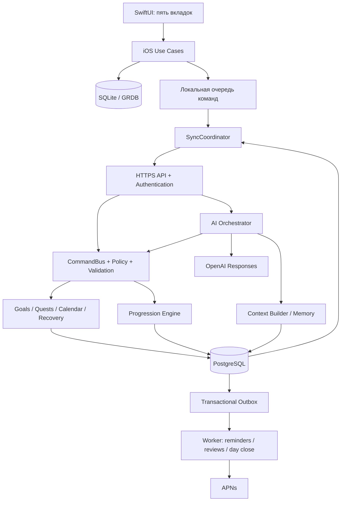

# 01. Архитектура системы

## 1. Общая схема



Backend, worker и PostgreSQL могут находиться на одном сервере в личной версии. Разделение процессов позволяет перезапускать worker без потери API-запросов. Сетевая микросервисная архитектура для этого масштаба не нужна.

## 2. Технологии

| Область | Выбор | Обоснование |
|---|---|---|
| iOS UI | SwiftUI, Observation, NavigationStack | Нативный интерфейс; состояние экрана отделено от хранилища |
| Конкурентность | async/await, actors, Sendable | Последовательная sync queue, UI на MainActor |
| Локальная БД | SQLite через GRDB; SQL migrations | Транзакции, наблюдение за выборками, явный offline journal |
| Networking | URLSession; собственные DTO из контрактов | Нет зависимости от vendor SDK в UI |
| Backend | TypeScript strict, Node.js LTS, Fastify | Валидация запросов и простая модульность |
| Data access | node-postgres, параметризованный SQL | Прозрачные транзакции/locks/RLS |
| Database | Поддерживаемый PostgreSQL | Реляционная целостность, JSONB для ограниченных payload |
| Jobs v1 | Outbox + небольшой PostgreSQL job worker | Без Redis; протокол retries/lease описан ниже |
| AI | Официальный OpenAI SDK за AIProvider | Первый provider полноценный, последующие по capability contract |
| Контракты | JSON Schema + OpenAPI 3.1 | Согласованные DTO и граница команд |
| Тесты | XCTest/XCUITest, Vitest, реальные PostgreSQL integration tests | Инварианты, migrations, offline, UI |
| Наблюдаемость | Структурированные редактированные логи + OpenTelemetry | Связать command_id, request_id, job_id без личного текста |

Версии не объявляются «последними» в документации: выбрать совместимые поддерживаемые версии в P0-01 и зафиксировать lockfiles/toolchain. [GRDB](https://github.com/groue/GRDB.swift) предоставляет SQLite-инструменты; [Fastify](https://fastify.dev/docs/latest/Reference/Validation-and-Serialization/) поддерживает схему валидации и сериализации. Выбор этих библиотек — наше архитектурное решение.

## 3. iOS: слои и зависимости

`View → FeatureModel → UseCase → Repository protocol → Local/Remote adapters`.

- View рендерит состояние и передаёт намерение пользователя. Никакого расчёта XP или сетевых запросов из body.
- FeatureModel (`@Observable`, `@MainActor`) управляет loading, ошибки, sheets, selection.
- UseCase создаёт команду, оптимистично меняет локальную проекцию и записывает outbox в одной SQLite-транзакции.
- Repository читает согласованную локальную проекцию. Remote response сначала попадает в sync/repository, а не непосредственно в View.
- `SyncCoordinator` actor обслуживает одну очередь на account, retries и cursor. Отдельный `Clock` даёт тестируемые дату/монотонное время.
- `ProgressionPreview` получает последний серверный snapshot и pending actions. Предварительный XP помечен «ожидает синхронизации»; authoritative Rank и новые уровни подтверждает сервер.
- `AppContainer` собирает зависимости; `MockContainer` используется только previews/tests. В production нет скрытого fallback на fake backend.

## 4. Backend: модули

| Модуль | Владеет | Вход / выход |
|---|---|---|
| Identity | users, devices, sessions | Apple proof → app session |
| Profile | распорядок, preferences, consent, baseline | редактирование профиля → domain event |
| Goals | goals, milestones, projects, metrics | план/измерение → progression evidence candidate |
| Quests | templates, occurrences, actions, activity | completion → validated ActivityRecord |
| Scheduling | availability, events, plan versions, placements | constraints → PlanProposal |
| Recovery | missed reasons, cases, recovery links | пропуск → ограниченные варианты возврата |
| Progression | rule sets, reward ledger, snapshots | validated activity → deterministic awards |
| AI | turns, tool runs, provider adapter | контекст → ответ / command proposal |
| Memory | подтверждённые факты, hypotheses, summaries | отбор контекста; исправление/удаление |
| Reviews | factual reports, trend aggregates | Daily/Weekly/Monthly facts |
| Notifications | reminders, device dispatch state | события → локальные descriptors/APNs |
| Sync | commands, change batches, tombstones | очередь клиента ↔ каноническое состояние |
| Privacy | export/delete workflows | запрос пользователя → job + receipt |

Модуль меняет собственные таблицы через use cases. Командная транзакция может атомарно обратиться к нескольким модулям через явные interfaces. Внешний AI/HTTP никогда не вызывается при удержании SQL-lock.

## 5. Ключевая транзакция выполнения

```mermaid
sequenceDiagram
  participant I as iPhone
  participant A as API / CommandBus
  participant P as Progression
  participant D as PostgreSQL
  I->>I: SQLite: pending completion + outbox
  I->>A: complete_quest(command_id, version, activity)
  A->>D: begin; lock user mutation counter; deduplicate
  A->>D: validate owner, occurrence, evidence; insert activity
  A->>P: calculate(validated facts, rules, prior buckets)
  P-->>A: reward entries + new projections
  A->>D: activity, status, ledger, change batch, outbox, receipt
  A->>D: commit
  A-->>I: committed receipt + canonical batch
  I->>I: reconcile pending; refresh views; celebrate once
```

Сбой до commit не создаёт частичной награды. Сбой ответа после commit приводит к повтору той же команды и получению прежнего receipt. Доставка worker events повторяемая; побочные эффекты дедуплицируются.

## 6. Фоновая обработка

`jobs`: id, kind, dedupe_key, payload_ref, due_at, attempts, lease_until, status, last_error_code. Не хранить полный чат в payload.

1. Dispatcher переносит outbox-события в jobs; уникальный dedupe_key предотвращает двойное создание.
2. Worker резервирует небольшую пачку через `FOR UPDATE SKIP LOCKED`, выставляет lease и фиксирует транзакцию.
3. Выполняет работу вне транзакции; при успехе отмечает done. При падении lease истекает, работа повторяется.
4. Retry: exponential backoff + jitter, максимум 8 попыток; затем dead-letter и operational alert.
5. Handler вызывает тот же CommandBus с системным actor, явным user_id и deterministic command_id.
6. Scheduler периодически проверяет просроченные day-close jobs. iOS не является надёжным cron-сервисом.

Для MVP это только перечисленные job types, без написания универсальной платформы очередей. При увеличении нагрузки адаптер можно заменить на готовую очередь; business idempotency сохраняется.

## 7. Предлагаемое дерево реализации

Ниже **будущие** файлы, не существующее приложение.

```text
apps/
  ios/
    SystemApp.xcodeproj/
    SystemApp/
      App/{SystemApp,AppContainer,RootRouter}.swift
      Features/{Onboarding,Today,System,Goals,Character,Calendar,Inbox,Settings,Reviews}/
      DesignSystem/{Tokens,SystemPanel,QuestCard,XPBar,RankBadge,SystemCore,Motion}.swift
      Resources/{Assets.xcassets,Localizable.xcstrings,PrivacyInfo.xcprivacy}
      Info.plist
    Packages/
      Domain/Sources/{Models,Commands,Time,Policies}/
      Application/Sources/{UseCases,Repositories}/
      Data/Sources/{SQLite,Migrations,Repositories,Sync,Networking}/
      Engines/Sources/{ProgressionPreview,CalendarMath,Timer}/
      Integrations/Sources/{Notifications,Keychain,EventKit,HealthKit,Voice}/
    SystemAppTests/
    SystemAppUITests/
    SystemWidgets/                         # Phase 5
    SystemWatch/                           # Phase 6
services/
  backend/
    src/
      app.ts
      server.ts
      worker.ts
      config.ts
      modules/{identity,profile,goals,quests,scheduling,recovery,progression,ai,memory,reviews,notifications,sync,privacy}/
      shared/{auth,db,commands,clock,errors,observability}/
    db/{migrations,seeds}/
    tests/{unit,integration,contracts,ai-evals}/
packages/
  contracts/{openapi.yaml,schemas,generated,fixtures}/
  rules/{progression,scheduling,recovery}/
  test-fixtures/{users,plans,activities,sync,calendar,ai}/
ops/
  compose.yaml
  Dockerfile
  env.example
  runbooks/{deploy,restore,delete-user,provider-outage,rotate-secrets}.md
docs/
  source/
  contracts/                              # текущие архитектурные черновики
  validation/
.github/workflows/{backend,ios,contracts}.yml
```

Создавать каталоги по потребности фазы, не генерировать десятки пустых модулей. В Phase 1 каждый backend-модуль обычно содержит `routes.ts`, `service.ts`, `repository.ts`, `types.ts`; pure engines — `engine.ts` и tests. Пакеты Swift не должны превращаться в один пакет на каждую кнопку.

## 8. Контракты расширения

`AIProvider`: generateTurn, generateStructuredPlan, capabilities; voice — отдельный `RealtimeProvider`, поскольку transport/lifecycle отличаются.

`Clock`: nowUTC, monotonicNow. `CalendarPolicy`: userDayAt, nextBoundary, expandRecurrence. `ProgressionEngine`: evaluateActivity, projectAt, reverseAward. `SchedulerEngine`: propose(snapshot, constraints). `RecoveryEngine`: propose(case, capacity). Все engine outputs сериализуемы и включают rule_version.

Новые providers, solver или storage adapter обязаны проходить те же acceptance fixtures. Интерфейсы не обещают, что любую модель можно заменить без проверки tool/voice capabilities.
