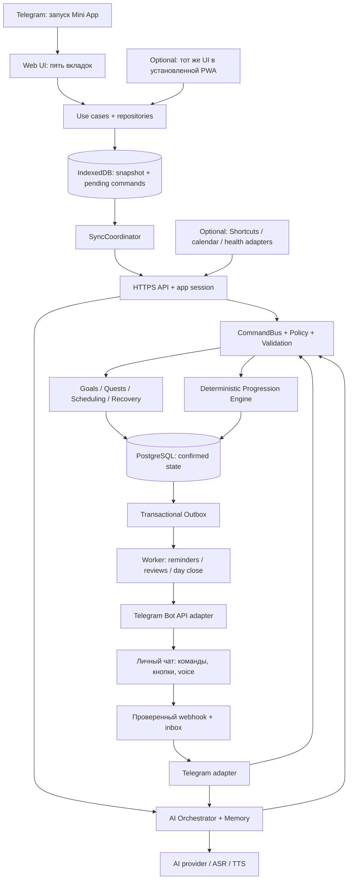

# 01. Архитектура системы: Telegram Mini App + бот

Актуально: 2026-09-16, ADR-013–016. Это целевая архитектура; наличие каждого модуля проверять по [handoff](13-handoff.md). Аудит сервера: [15](15-backend-review.md).

## 1. Общая схема



Один модульный backend, отдельный worker, одна PostgreSQL. Mini App — главный продуктовый интерфейс; бот — быстрый вход и канал связи. Прогресс не хранится в сообщениях бота. PWA — дополнительный режим того же клиента после проверки потребности в независимом offline-запуске; не третья кодовая база и не условие начала пилота.

## 2. Технологии

| Область | Решение | Статус |
|---|---|---|
| Mini App | TypeScript + React + Vite, CSS tokens, SVG; mobile first | Предлагаемый клиент; scaffold ещё нет |
| Telegram bridge | Небольшой adapter над официальным WebApp API | Capability checks и fallback, domain не зависит от Telegram |
| Локальные данные | IndexedDB, transactional command journal, repositories | Проверить в T-05; wrapper только при необходимости |
| Секреты клиента | Access в памяти; refresh в SecureStorage при поддержке | Нет tokens в IndexedDB/localStorage; fallback — повторный login |
| Backend | Существующие TypeScript strict, Fastify, node-postgres | Сохранить pins/lockfile; [toolchain](toolchain.md) |
| Jobs | PostgreSQL outbox + worker с lease fencing | Основа есть, исправления T-00b обязательны |
| AI | AIProvider; отдельные ASR/TTS adapters | Серверные ключи; модель после eval |
| Contracts | JSON Schema + OpenAPI 3.1; общие DTO | OpenAPI перечисляет только реализованные endpoints |
| Web tests | Vitest + Playwright; реальные Telegram clients | Browser mocks не доказывают свойства WebView |
| Hosting | HTTPS origin: web assets + reverse proxy `/api`; API/worker/DB | Railway — кандидат из прежнего плана, запуск не проверен |

Выбор React/Vite — наше решение для компонентов и сборки, не требование Telegram. Перед добавлением зависимостей проверить совместимость с существующим Node и закрепить версии. [React](https://react.dev/learn), [Vite](https://vite.dev/guide/). Не добавлять SSR, Redis, отдельный bot framework или WebGL engine без конкретной задачи.

## 3. Клиент: слои

`View → FeatureModel/Hook → UseCase → Repository → local store / API`.

- View показывает состояние, не считает confirmed XP и не вызывает Bot API.
- UseCase создаёт UUID команды и одной IndexedDB-транзакцией сохраняет intent + optimistic overlay. Ошибка сохранения не может выглядеть успешной отметкой.
- Canonical snapshot и pending overlay разделены. Смена пользователя переключает отдельное хранилище; чужой кэш не показывается даже на loading screen.
- SyncCoordinator отправляет immutable команды, применяет receipts/batches; одна активная отправка на account/installation. Несколько окон координируются локальным lock/leader, correctness дополнительно защищает сервер.
- ClientCapabilities определяет Telegram methods, устойчивость storage, service worker, fullscreen, haptic, mic. Наличие метода и фактический успех проверяются отдельно.
- Telegram adapter управляет lifecycle, BackButton, safe areas, темой и запуском; browser adapter нужен тестам и будущей PWA.
- Timer хранит интервалы и timestamps, а не число тиков `setInterval`. Закрытый WebView не обязан выполнять код.
- RewardPreview опционален: до паритета с engine показывать «награда после синхронизации». Level Up — по уникальному server transition ID.

Offline/auth — [06](06-api-and-sync.md), интерфейс — [07](07-ios-and-experience.md), Telegram — [14](14-telegram-platform.md).

## 4. Backend: владение модулями

| Модуль | Владеет | Вход / выход |
|---|---|---|
| Identity | users, external identities, devices, sessions | Проверенное Telegram proof → internal user → app session |
| Telegram | update inbox, chat binding, action tokens, Bot API transport | Update → domain intent; receipt → сообщение |
| Profile | preferences, consent, baseline, распорядок | Изменение профиля → versioned event |
| Goals | goals, milestones, projects, metrics | План / измеримый результат |
| Quests | templates, occurrences, actions, ActivityRecord | Проверенный факт выполнения |
| Scheduling | availability, events, user days, placements, proposals | Constraints → допустимый план |
| Recovery | missed reasons, cases, recovery links | Ограниченное возвращение без наказания за болезнь |
| Progression | rules, award ledger, snapshots | Activity → deterministic awards |
| AI / Memory | turns, tools, memories, hypotheses | Context → ответ / proposal / command |
| Reviews | фактические отчёты и narrative revisions | History → факты и объяснение |
| Notifications | preferences, schedules, delivery ledger | Reminder revision → transport job |
| Integrations | connections, imports, source mappings, calendar feeds | Внешние факты → evidence/availability |
| Sync | receipts, counters, batches, tombstones | Канонический журнал изменений |
| Privacy | export/delete/revocation workflows | Запрос пользователя → job + receipt |

Модули пишут собственные таблицы через interfaces внутри общей транзакции. Telegram adapter, UI и LLM не пишут напрямую в progression. AI/HTTP не вызываются под SQL-lock. Боту не выдаётся глобальный пользовательский bearer token: actor выводится из проверенного update, ownership проверяется обычным domain policy.

## 5. Выполнение квеста из любого канала

```mermaid
sequenceDiagram
  participant C as Mini App / Bot / AI Tool
  participant A as CommandBus
  participant D as PostgreSQL
  participant P as Progression Engine
  C->>A: normalized command + version + actual activity
  A->>D: begin; tenant context; user lock; semantic hash / receipt
  A->>D: owner + target + version + evidence validation
  A->>P: Activity + rules + prior buckets
  P-->>A: award deltas + projections
  A->>D: Activity + state + ledger + changes + outbox + receipt
  A->>D: commit
  A-->>C: canonical receipt
  C->>C: reconcile; celebrate server transition once
```

До Phase 3 тот же путь сохраняет Activity без выдуманного XP. Потеря ответа после commit разрешается повтором той же команды. Два устройства, завершившие одну occurrence, не создают два root действия. Канал не влияет на формулы.

## 6. Worker и внешняя доставка

1. Dispatcher атомарно переводит outbox в jobs с уникальным dedupe key.
2. Claim берёт только свободную вместимость worker. Каждая аренда имеет уникальный `lease_token`/generation, `lease_until`, attempt и max_attempts.
3. Success/failure/renewal — compare-and-set по актуальному token. Устаревший исполнитель не меняет новую аренду. Истечение lease не разрешает превышать max_attempts.
4. Долгая работа продлевает аренду; crash/retry/backoff/jitter/dead-letter тестируются с двумя workers.
5. Domain handlers используют CommandBus и deterministic command ID. Внешний HTTP идёт после commit.
6. У Telegram sends нет нашей гарантии exactly-once: timeout может означать уже доставленное сообщение. Delivery ledger хранит `pending/sending/sent/unknown/failed`, известный message_id редактируется; неизвестный исход не запускает бесконечную рассылку.
7. Перед reminder проверить revision/status, quiet hours, consent, blocked state. Фоновый cron не зависит от Mini App.

## 7. Дерево реализации

Backend-каркас уже есть; остальные каталоги создавать по задаче.

```text
apps/miniapp/                         # будущее
  src/app/{bootstrap,router,container}/
  src/features/{onboarding,today,system,goals,character,calendar,inbox,settings,reviews}/
  src/design/{tokens,components,motion}/
  src/application/{commands,repositories,sync,timer}/
  src/adapters/{telegram,browser,indexeddb,http,secure-storage}/
  src/pwa/                           # позже: manifest, service worker, browser auth
  tests/{unit,contracts,e2e}/
services/backend/
  src/{app,server,worker,config}.ts
  src/modules/{identity,telegram,profile,goals,quests,scheduling,recovery,
               progression,ai,memory,reviews,notifications,integrations,sync,privacy}/
  src/shared/{auth,db,commands,time,errors,observability}/
  db/migrations/
  tests/{unit,integration,contracts,ai-evals}/
packages/
  contracts/{openapi.yaml,schemas,generated,fixtures}/
  rules/{progression,scheduling,recovery}/
  test-fixtures/
ops/{compose.yaml,Dockerfile,env.example,runbooks}/
docs/{source,validation,archive}/
```

Возможный будущий `apps/ios-companion/` — HealthKit/WidgetKit/ActivityKit bridge поверх того же account/API, после отдельного поручения и появления Mac. Он не зависимость Telegram MVP.

## 8. Контракты расширения

`AIProvider`: generateTurn/generateStructuredPlan/capabilities. `SpeechProvider`: transcribe/synthesize. `RealtimeProvider` — отдельный будущий lifecycle, без обязательства делать его вместе с voice notes.

`Clock`: nowUTC/monotonicNow; `CalendarPolicy`: userDayAt/nextBoundary/expandRecurrence; `ProgressionEngine`: evaluateActivity/projectAt/reverseAward; `SchedulerEngine`: propose(snapshot,constraints); `RecoveryEngine`: propose(case,capacity).

`ClientPlatform`: launchContext/capabilities/lifecycle/navigation/feedback; `LocalStore`: transactional pending + canonical projections; `NotificationTransport`: send/edit/revokeWhenPossible; `EvidenceAdapter`: normalize/match/revise. Outputs engines включают rule_version. Новый adapter проходит общие acceptance fixtures.
