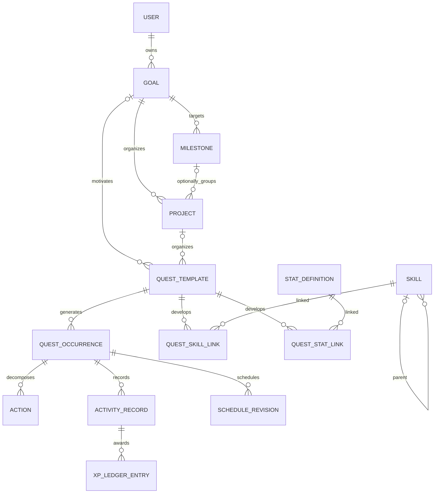

# 02. Домен, модель данных и состояния

## 1. Общие соглашения

- ID: UUID; для client-created объектов UUIDv4. Порядок синхронизации определяется серверным cursor, не UUID/временем телефона.
- Почти все пользовательские таблицы: `id, user_id, version bigint, created_at, updated_at, deleted_at?`. Shared catalog и immutable events — явные исключения.
- UTC instants: PostgreSQL `timestamptz`; IANA timezone хранится отдельно. Date-only: `date`. Продолжительность: целые секунды. XP: `bigint` milli-XP (1000 = 1 XP). Доли: basis points (10000 = 100%).
- API передаёт bigint счётчики/XP/cursor десятичными строками, чтобы JavaScript не терял точность. Версии малых объектов — integer с проверкой safe range.
- Mutable records — optimistic concurrency; исторические события и award ledger append-only до удаления аккаунта.
- Каждая связь пользовательских объектов проверяет `(user_id, id)` через составной FK/unique. Одного UUID недостаточно для запрета связи с чужим пользователем.
- В JSONB только версиями ограниченные документы: rubric, structured memory, command payload. Goal, time, status, relations не прятать в большой JSON.
- `deleted_at` создаёт tombstone. Архивация остаётся видимой в истории; удаление аккаунта физически очищает и ledger.

## 2. Основные связи

Milestone — измеримая проверка, Project — контейнер работы; их нельзя считать синонимами. У простой цели нет обязательного искусственного Project. Standalone Quest возможен без Goal; UI честно показывает «Личное действие».

## 3. Сущности: профиль и доступ

| Таблица | Ключевые поля сверх общих | Ограничения / применение |
|---|---|---|
| users | internal UUID, locale, status; пока auth_issuer/auth_subject | Telegram subject не становится primary key домена; перенос identity в отдельную таблицу — T-01 |
| user_profiles | display_name, onboarding_state, system_style, timezone, day_boundary_minutes | 1:1; boundary 0…1439; стиль mentor/commander/companion/system |
| profile_baselines | domain, self_assessment, measured_value, unit, observed_at, source | Исходные способности без XP; версии при изменении |
| user_preferences | key, value, schema_version | Только разрешённый key registry |
| constraints | type, payload, valid_from, valid_until, source | time/money/equipment/accessibility/avoidance; sensitive flag |
| availability_rules | weekdays, wall_start, wall_end, timezone, effective_from, recurrence | Работа/сон/дорога/отдых/свободные окна; интервалы через полночь |
| consent_records | scope, granted, policy_version, recorded_at | Append-only; текущий доступ — последняя запись |
| devices | installation_id, platform, client_kind, sync_state, revoked_at | Installation Mini App/PWA, не Telegram user ID или fingerprint; native push token только при появлении adapter |
| sessions | user_id, refresh_hash, family_id, expires_at, revoked_at | Refresh rotation/reuse detection; plaintext refresh не хранить |

## 4. Цели, roadmap, задания

| Таблица | Основные поля | Семантика |
|---|---|---|
| goals | title, description, why, start_date, target_date?, success_criterion, priority, status, difficulty_hint | draft/active/paused/completed/archived; завершение по критерию, не по XP |
| goal_metrics | goal_id, name, unit, baseline, target, direction, aggregation | `count/sum/latest/pass_fail`; прогресс по определённой метрике |
| metric_observations | metric_id, value, observed_at, evidence_id?, source | Хранят реальные результаты; исправления с supersedes_id |
| milestones | goal_id, title, ordinal, target_date?, rubric, status, evidence_policy | blocked/available/achieved/waived; waived не даёт milestone award |
| projects | goal_id, milestone_id?, title, status | Объединяет задачи, может относиться к одному milestone |
| goal_dependencies | predecessor_goal_id, successor_goal_id | DAG: циклы запрещены |
| quest_templates | goal_id?, milestone_id?, project_id?, title, why, category, activity_family_id, recurrence?, normal_spec, minimum_spec?, difficulty, challenge_stage, rubric_version, reward_eligible | category main/daily/skill/discipline/side/boss/recovery; frozen reward profile на occurrence |
| quest_occurrences | template_id, recurrence_key, assigned_user_day, timezone_snapshot, template_snapshot, execution_status, completion_variant?, required_amount, unit, deadline?, deadline_kind, supersedes_id? | unique template+recurrence_key; разовая задача имеет один экземпляр |
| quest_actions | occurrence_id, title, ordinal, required, status | Checklist, без отдельного XP; несамостоятельные шаги |
| quest_dependencies | predecessor_occurrence_id, successor_occurrence_id, dependency_type | hard/soft; hard dependency блокирует планирование/старт |
| habits | template_id, target_frequency, minimum_success_spec, rest_policy | Режим регулярного Quest, без второй системы completion |
| inbox_items | raw_text, source, state, converted_entity_type?, converted_entity_id? | open/converted/archived; идемпотентная конвертация |

При указанных `project_id` и `milestone_id` все связанные Goal должны совпадать. `normal_spec/minimum_spec`: `{duration_seconds?, amount?, unit, success_rule}`; minimum меньше normal по объёму и сохраняет смысл. Нельзя считать «открыть приложение» minimum тренировки.

Recurrence MVP: daily, selected weekdays, weekly frequency with explicit selected days. Arbitrary RRULE и complex exceptions добавлять в Phase 5. На сервере материализовать следующие 14 пользовательских дней, горизонт редактируемый. Каждая occurrence сохраняет снимок правил, будущая правка template не изменяет завершённое прошлое.

## 5. Действия, подтверждения и прогрессия

| Таблица | Основные поля | Инвариант |
|---|---|---|
| activity_records | occurrence_id, root_activity_id, occurred_start, occurred_end, duration_seconds, amount?, source, source_event_id?, canonical_family_id, variant, state, replaces_id?, credited_day_id | Факт действия; accepted/pending_review/reversed; overlap budget учитывается один раз |
| evidence_records | activity_id?, milestone_id?, type, provider, external_id?, summary, artifact_ref?, observed_at, confidence_label | self/timer/device/result/milestone; device не означает криптографическое доказательство |
| timer_sessions | occurrence_id, started_at, elapsed_active_seconds, state, device_id | idle/running/paused/finished; интервалы пауз не начисляются |
| activity_families | user_id, canonical_key, display_name, parent_id?, kind | activity vs routine; одинаковые действия разделяют лимит |
| skill_definitions | user_id, name, canonical_key, parent_id?, category, archived_at | Ациклическое дерево; unique canonical_key; merge через явную команду |
| quest_skill_links | template_id, skill_id, allocation_bp | ≤3 прямых навыка; сумма ровно 10000 при наличии |
| stat_definitions | code, display_name, description | Shared BODY/ENDURANCE/MIND/FOCUS/DISCIPLINE/SOCIAL; RECOVERY позже |
| quest_stat_links | template_id, stat_code, allocation_bp | Сумма 10000; нет дополнительного глобального XP |
| progression_rule_sets | version, config_json, checksum, effective_at, status | Immutable activated rules |
| reward_profiles | occurrence_id, rule_version, difficulty, skill_allocations, stat_allocations, rubric_version, baseline_version | Запечатывается до начала или на первом завершении ad-hoc task |
| xp_ledger_entries | activity_id?, milestone_id?, account_type, account_id?, amount_mxp, entry_kind, reverses_entry_id?, rule_version, input_hash, calc_revision | global/skill/stat; unique award allocation key; positive award либо correction |
| skill_progress_snapshots | skill_id, mastery_mxp, level, form_bp, as_of_day, rule_version | Восстанавливаемая проекция, не источник фактов |
| stat_progress_snapshots | stat_code, mastery_mxp, value_hundredths, current_value_hundredths | Тот же принцип |
| character_snapshots | lifetime_mxp, lifetime_level, power_bp, current_level, rank, streak, as_of_day, rules_version | Одно подтверждённое состояние и история по дням |
| milestone_awards | milestone_id, rubric_version, outcome_fingerprint, credited_at | Один reward на результат; повторный импорт не повторяет награду |
| milestone_skill_links | milestone_id, skill_id, allocation_bp | Checkpoint gate и распределение milestone reward по навыкам |
| maintenance_targets | target_type, target_id, effective_week, weekly_minutes, version, source_plan_id | Цель поддержания формы; новые значения только на будущую неделю |

`root_activity_id` связывает completion, minimum, дополнительные минуты, подтверждение внешнего health adapter и исправление. Новый способ доказательства обновляет факт, а не создаёт ещё одно действие. Activity может быть полезной даже при нулевой дополнительной награде из-за лимита.

## 6. Расписание, восстановление, ИИ

| Таблица | Основные поля |
|---|---|
| calendar_events | title, starts_at?, ends_at?, local_start_date?, local_end_date_exclusive?, timezone, all_day, busy, origin, external_ref?, version |
| schedule_revisions | occurrence_id, previous_id?, starts_at?, ends_at?, assigned_user_day, placement_state, variant, reason_code, plan_version_id |
| plan_versions | scope, date_from, date_to, version, input_versions, rules_version, state, author |
| plan_proposals | base_plan_version, diff, explanations, violations, expires_at, approval_state, approval_policy_version |
| user_days | local_date, zone_snapshot, boundary_snapshot, starts_at, ends_at, closed_at?, status, reward_epoch | effective user-day identity, без дублирования при DST |
| day_commitments | user_day_id, occurrence_id, frozen_expected_amount, minimum_amount, priority, excused_at? | База adherence; вечернее удаление не улучшает утренний denominator |
| recovery_cases | missed_occurrence_id, reason, user_confirmed, state, expires_at, debt_units, recovery_occurrence_id? |
| protection_periods | starts_at, ends_at, reason_category, progression_mode | Самообъявленный отдых/болезнь; raw diagnosis не нужен |
| reminders | target_type, target_id, fire_at, channel, quiet_policy, dedupe_key, revision, state |
| external_mappings | provider, device_scope, external_id, internal_id, fingerprint, sync_direction, revision |
| conversations / messages | role, content, turn_id, created_at, retention_class, tool_run_refs |
| ai_turns / tool_runs | request_id, model_id, prompt_version, input_refs, tool_name, proposal_id?, command_id?, status, token_usage, error_code |
| memory_items | kind, content_structured, source_refs, confidence, sensitivity, valid_from, expires_at?, user_confirmed, supersedes_id? |
| review_reports | period_type, start_day, end_day, facts_snapshot, narrative?, inputs_version, rules_version |
| experiments | hypothesis, intervention, baseline_period, trial_period, outcome_metric, consent, state |

Phase 1 создаёт только используемые таблицы; voice, experiments, complex evidence и external mappings приходят вместе с функциями. Формат связей заранее согласован.

## 7. Технические сущности

`command_receipts(user_id, command_id, payload_hash, result, committed_seq)`; целевое расширение T-00a: command kind, semantic hash/version; `user_change_counters(user_id, seq)`; `sync_change_batches(user_id, seq, changes, schema_version)`; `domain_events(event_id, user_id, aggregate_id, kind, payload, schema_version)`; `outbox_events`, `jobs`, `device_sync_cursors`, `deletion_jobs`, `export_jobs`, `audit_events`.

Локально дополнительно: `pending_commands`, `canonical_records`, `optimistic_overlays`, `sync_metadata`, `pending_conflicts`. Клиент не отправляет таблицы snapshots или ledger как изменяемые данные.

## 8. Состояния Quest — каноническая трактовка

У occurrence **две оси**, а не один перегруженный status:

- `execution_status`: planned / active / partial / completed / missed / excused / cancelled.
- `placement_state`: unscheduled / scheduled / rescheduled.

Это сохраняет все семь пользовательских статусов исходного документа и добавляет отмену. API хранит обе оси; legacy-label `rescheduled` отображается как badge, если выполнение ещё не завершено.

| Из → в | Команда / событие | Правило |
|---|---|---|
| planned → active | start_quest | Нет несовместимого running timer |
| planned/active → completed | complete_quest | Normal достигнут либо minimum достигнут с `variant=minimum` |
| planned/active → partial | record_partial | Объём >0, критерий ещё не выполнен |
| partial → active/completed | resume/complete | Только delta к уже учтённой Activity; без второй полной награды |
| planned/active → missed | close_user_day | Истёк day boundary, нет accepted completion/excuse |
| partial → partial | close_user_day | Сохранить фактический прогресс; поставить `closed_incomplete=true`, рассмотреть Recovery |
| missed → excused | explain_missed | Пользователь указал изменившие условия обстоятельства; доказательства не требуются |
| missed → completed/partial | reconcile_late_completion | Действие фактически было выполнено, синхронизация запоздала; пересчитать последствия |
| missed → missed | создать recovery replacement | Новый occurrence связан с исходным; прошлый пропуск остаётся в истории |
| planned/active/partial → cancelled | cancel_quest | Сохраняется выполненная Activity; явное undo нужно для её отмены |
| completed → planned/partial | undo_completion | Compensating ledger entries, новая версия; отдельная команда |
| любой живой placement → rescheduled | reschedule_quest | Меняется ScheduleRevision, идентичность occurrence сохраняется |

Перенос до закрытия дня не создаёт пропуск и новый XP slot. После закрытия дня запланировать replacement, не переписать вчера как будто задачи не было. Возврат старой ошибочной даты — correction с audit trail.

Пропуск без указанной причины не считается доказанной «ленью»: debt создаётся только по подтверждённому ответу пользователя. `skip_quest` принимает reason и означает excused либо ранний missed/abandoned через Recovery policy; не удаляет историю.

## 9. Индексы и обязательные ограничения

- `(user_id, assigned_user_day, execution_status)`, `(user_id, goal_id, status)`, `(user_id, occurred_start)`, `(user_id, canonical_family_id, credited_day_id)`.
- Unique `(user_id, command_id)`, `(user_id, template_id, recurrence_key)`, `(user_id, provider, source_event_id)` там, где source id достоверно определён.
- Unique ledger award identity включает activity/root, account, target, calc_revision; reversal ссылается на конкретную исходную запись и тоже уникален.
- `end > start`, duration ≥0, allocations 0…10000; сумма allocations проверяется deferred/application validation в той же транзакции.
- Структура skill/dependency DAG проверяется при mutate под user lock. Нельзя сделать родителем потомка.
- Hard booking overlap запрещён Scheduler/commit validation; диапазоны `[start,end)` допускают смежные события.
- Период review и RuleSet неизменяемы; regeneration создаёт revision.
- Все user tables защищены RLS. Владельцы PostgreSQL-таблиц обычно обходят RLS, поэтому runtime-role отделена от migration-owner; настройку проверять интеграционными тестами. [PostgreSQL RLS](https://www.postgresql.org/docs/current/ddl-rowsecurity.html)

## 10. Telegram и integrations: планируемые расширения

Ниже целевые сущности, **не существующие миграции**. Добавлять по T-01/02 и Phase 5, с RLS/ownership и версиями контрактов. Существующие users/devices/sessions не пересоздавать и не менять их UUID.

| Сущность | Ключи / смысл | Инвариант |
|---|---|---|
| external_identities | user_id, issuer, subject, verified_at, revoked_at | unique(issuer,subject); identity lookup узко разрешён до tenant context; linking не по username |
| telegram_chats | bot_id, telegram_user_id, user_id, private_chat_id, write_allowed, blocked_at | Принадлежность из verified update; chat ID не user ID; внутренний UUID не меняется |
| telegram_auth_exchanges | bot_id, proof_digest, expires_at, consumed_at | Single-use proof digest; raw initData не хранить, TTL cleanup |
| telegram_update_inbox | bot_id, update_id, sender_ref, status, payload_ref, received_at | Unique(bot_id,update_id); atomic ack; raw payload короткоживущий |
| telegram_action_tokens | token_hash, user_id, target, expected_version, kind, command_id, expires_at, receipt_ref | One semantic command per token, ownership+expiry+version |
| notification_deliveries | user_id, notification_key, revision, channel, state, message_id, attempt | Unique notification/revision/channel; unknown send outcome не равен failed |
| integration_connections | user_id, provider, scopes, credential_hash/encrypted, consent_ref, revoked_at | Credential не разрешает общий CommandBus; отдельная проверка scope |
| integration_import_batches | connection_id, source_range, observed_at, complete, revision, status | Partial import не удаляет отсутствующие записи |
| calendar_feeds | user_id, token_hash, selection, redaction_mode, revoked_at | Feed URL является ограниченным секретом; не содержит session token |
| day_policy_epochs | user_id, timezone, boundary, effective_at, version | Переходы без overlapping days/double buckets; T-00d |

Inbox/identity lookup до определения user и worker-wide dispatch требуют узких explicit database policies/functions; не отключать tenant isolation целиком. Все user-owned связанные строки имеют составные FK. Web `device_id` — зарегистрированная installation, не случайный UUID на каждый запрос. Для bot/system actor использовать отдельный trusted actor context с audit metadata; не имитировать чужой device.

Идентификаторы Telegram и PostgreSQL BIGINT counters не округлять при JSON/JavaScript преобразовании. Канонический wire type закрепить в схемах, включая версии; тестировать крайние значения. Новые tables/columns проходят миграцию upgrade уже созданной synthetic БД, а не только clean install.
