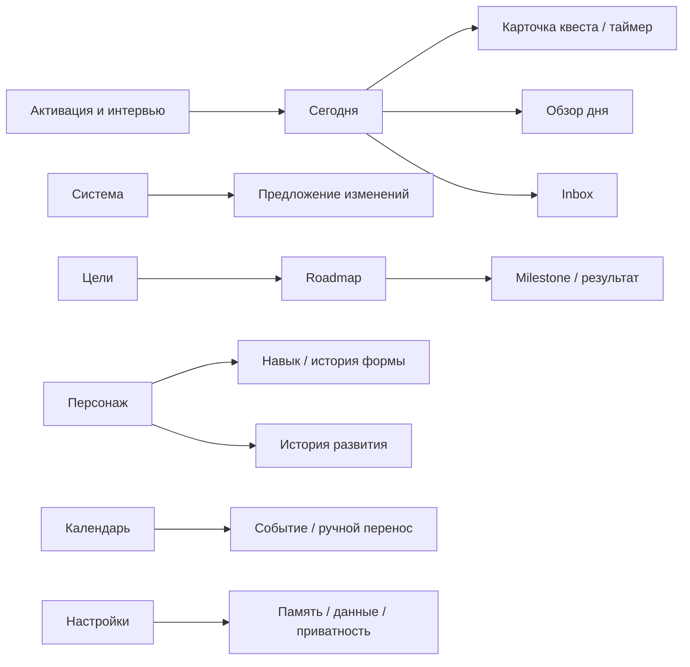

# 07. Telegram Mini App: экраны и пользовательский опыт

Имя файла сохранено для совместимости ссылок. Спецификация относится к web UI; native дизайн находится в историческом архиве. Главный интерфейс — Mini App, бот дополняет его быстрыми действиями.

## 1. Навигация

Пять вкладок: **Сегодня / Система / Цели / Персонаж / Календарь**. Inbox, настройки, история, память и review открываются из соответствующей вкладки. Внутренние английские RPG-ярлыки — стиль, русский основной текст остаётся понятным.

Deep links Telegram: `https://t.me/<bot>/<app>?startapp=<opaque_route>` для выбранного launch mode. Payload — короткая ссылка на экран/серверный route descriptor, без токенов сессии и чувствительного текста. Backend после auth проверяет owner/существование; переход не подтверждает действие. Browser/PWA adapter использует свои обычные routes. BackButton закрывает sheet/возвращает на предыдущий экран, перед выходом при несохранённом draft — доступный closing confirmation.

## 2. Onboarding — активация Системы

Последовательность: welcome → privacy summary → проверенный Telegram вход/сохранённый draft → стиль общения → график и protected time → одна цель → baseline/результат → draft roadmap → today plan.

Интервью прогрессивное: 5–10 минут до первого полезного плана как целевой ориентир; необязательные детали собираются позже. Каждый шаг сохраняется, Back не стирает ответы, можно перейти на ручную форму. Вопросы объединять по смыслу, не выдавать анкету из 50 пунктов за раз.

Первое объяснение Character: «Показатели отражают прогресс, зафиксированный с начала использования. Твои уже имеющиеся навыки учитываются при подборе заданий». Не говорить, что человек начинает жизнь с нуля.

Разрешения: сообщения бота после первого reminder; микрофон только при записи в Mini App; календарь/здоровье при явном включении внешнего bridge. Voice message в чате записывает сам Telegram. Отказ не блокирует приложение.

## 3. Сегодня

Порядок контента:

1. System status + дата user-day + маленький sync indicator при необходимости.
2. Компактный character summary: Current Level, Lifetime progress, rank.
3. Одно главное действие с связью с Goal и доступным временем.
4. Остальные quests, группировка «сейчас / дальше / без времени».
5. Объём плана: принято N минут, сделано M; часы отдыха не названы «потерянными».
6. System Core button для текста/voice; long press только если доступно альтернативное явное действие.
7. Review CTA в конце пользовательского дня.

QuestCard: title, goal reason, start/duration, difficulty, reward estimate, normal/minimum, status. Primary action Start/Complete; secondary Minimum/Move/Explain missed. На главном экране максимум 1 главный квест; точный общий список не скрывается.

Пустой день: «Сегодня нет запланированных заданий» + создать/выбрать из Goal; день отдыха имеет собственный спокойный экран. Offline completion не блокируется спиннером сети.

## 4. Quest Detail и Timer

Показать «Почему я это делаю», Goal → Milestone → Quest, критерий успеха, normal/minimum, checklist, навыки/характеристики, estimated XP breakdown, историю переносов, подтверждение.

Timer state machine: idle → running ↔ paused → finished; cancel не означает completed. В активном документе countdown использует monotonic clock и timestamps; после background нельзя полагаться на JS ticks. Данные сохраняются при каждой смене состояния и периодически без записи каждую секунду. После прерывания/убийства процесса восстановить elapsed и запросить спорный интервал. Завершение таймера предлагает записать фактический результат.

Completion sheet: нормальная/минимальная/частичная версия, фактический объём, optional note; self-report default. Unknown duration не подставлять молча. Undo доступен из receipt/history; влияет на ledger по контракту.

## 5. Система

Chat bubbles + structured cards: Goal draft, Plan diff, Quest receipt, Memory candidate, Clarification choices, Review facts. Карточки строятся из backend DTO, не парсятся из Markdown ответа.

State: idle / sending / streaming / waiting_for_tool / awaiting_confirmation / provider_error / offline. Кнопка stop отменяет генерацию; если command уже committed, показывается receipt с Undo, а не ложное «всё отменено».

Стили mentor/commander/companion/system меняют формулировки, длину и озвучку. Все стили сохраняют одни и те же ограничения, уважение и право пользователя управлять задачами.

## 6. Цели и Roadmap

Список: active, paused, completed, archived. Goal card показывает измеримый результат, current metric/target, ближайший milestone, бюджет и следующий шаг. Не рассчитывать процент цели из числа произвольно созданных Quest.

Detail: why → baseline/target/date → дорожная карта → Projects → будущие/выполненные tasks → metric history. Roadmap обычным вертикальным списком с раскрытием этапов в MVP; граф зависимостей/Skill Trees позднее. Дальние этапы грубые, ближайшие 1–2 недели детальны.

Изменение срока/критерия показывает impact proposal. `Complete goal` запрашивает критерий/результат; список checklist сам по себе не подтверждает владение навыком.

## 7. Персонаж и Skills

Character: нейтральный силуэт, Current/Lifetime с кратким объяснением, Current Rank/highest rank, six stats, текущие skills, streak, active protection/recovery effects, timeline.

Stats не рисовать как доказанные сравнения с другими людьми. Для ранних маленьких значений числовой список понятнее radar chart; при необходимости chart с читаемыми подписями.

Skill detail: earned level, checkpoint gate, MasteryXP, Form trend, часы и реальные результаты, parent/children, maintenance target, следующая рекомендуемая практика. New Skill требует Accept; duplicate/merge объясняет, куда попадёт история.

Полноэкранные Skill Unlock/Level Up только после подтверждения server transition, с возможностью пропустить, отключить звук/анимацию. Offline предварительная completion может иметь небольшой haptic, подтверждённый level — после sync.

## 8. Календарь

Day: timeline + список unscheduled. Week: компактная сетка/agenda. Month: загрузка и основные даты; tap → day. Все три режима в MVP, сложный desktop drag-and-drop не обязателен.

Типы: task, habit occurrence, event, deadline marker, milestone marker. Goal целиком не превращается в busy interval. All-day/deadline markers визуально отделены от занятых слотов. Ручной перенос через sheet с проверкой конфликтов, undo, сохранением истории.

Recurrence edit: this occurrence / future occurrences; прошлая история неизменна. Outside Calendar integration показана badge, явный выбор, что редактируется во внешней системе.

## 9. Settings, память и данные

Профиль/распорядок; часовой пояс и boundary; стиль; нагрузка и automation policy; quiet hours; звук/haptic/motion; privacy/consents; интеграции; «Что Система помнит»; export/delete; debug diagnostics без секретов для личного пилота.

BYOK скрыт в public build и не входит в MVP. Персональный режим API key может появиться отдельным feature flag после security review (см. 09).

## 10. Design System

Направление: почти чёрные поверхности, холодный cyan/blue, немного violet, тонкие рамки и умеренное свечение. Свой silhouette, icon set и композиция; не переносить интерфейс/ассеты Solo Leveling.

Исходные tokens (проверить фактический контраст в T-03a/P1-08): background `#080B12`, surface `#111827`, elevated `#182235`, text `#EAF2FF`, secondary `#A4B3C7`, accent `#62D9FF`, violet `#AA9CFF`, success `#66D7A5`, warning `#F3C56B`.

Компоненты: SystemPanel, QuestCard, MainQuestCard, XPBar, RankBadge, StatRow, SkillRow, SystemCore, PlanDiffCard, RewardReceipt, EmptyState, SyncBanner, ConfirmationSheet. Tokens: spacing 4/8/12/16/24/32; rounded corners 12/20; touch area как минимум 44 CSS px; основной текст системным шрифтом, относительные размеры и масштабирование; monospaced только короткие числа/статусы.

Motion: небольшие появления 150–250ms; celebration до 1.5s; нет бесконечного тяжёлого particle background. `prefers-reduced-motion` и пользовательский переключатель отключают scanning/parallax/particles; звук и haptics независимо отключаемы. Голубой цвет не единственный индикатор completed; label/icon обязательны.

## 11. Доступность и производительность

Семантические HTML controls/ARIA позволяют VoiceOver/TalkBack читать связь задачи с целью, состояние, minimum и команды; декоративный силуэт скрыт для accessibility. Большой шрифт не обрезает действия; charts имеют текстовый эквивалент. Светлая тема может быть позже, но high contrast/readability в тёмной обязательны.

Engineering targets до измерений: local Today first meaningful content <1s на целевом устройстве; local completion feedback <100ms; list scrolling без тяжёлой sync на main thread. Не обещать цифры до browser profiling и реальных Telegram device tests. Цель плавности — 60fps, упрощение эффектов на слабом устройстве. Fullscreen/haptic — улучшения при поддержке, не условия доступа к кнопкам. Battery: таймер не пишет в БД каждую секунду, анимации паузятся вне видимости, network batching.

## 12. Состояния, которые обязаны иметь дизайн

Fresh install, no goals, rest day, permission denied, no network, expired login, AI budget exhausted, ambiguous voice, stale proposal, partial sync, conflicting edit, old app schema, long absence, protection, archived goal, deleted deep link, very long Russian text, accessibility text size, restored app after crash.

По этим состояниям создать web state fixtures и screenshots в Phase 1–3; сквозные device tests перечислены в документе 11.

## 13. Погружение внутри Telegram

- Fullscreen запросить после понятного пользовательского действия, не блокировать обычный viewport при отказе. Учитывать одновременно Telegram safe/content-safe areas, keyboard и изменения viewport; дважды не прибавлять один inset.
- CSS tokens адаптируют контраст и chrome под тему Telegram; тёмный System theme остаётся осознанным режимом. Системная кнопка закрытия не перекрывает Complete.
- SVG silhouette/skill tree, лёгкие CSS transitions и короткая celebration создают RPG-подачу. Тяжёлый 3D/бесконечные particles не обязательны атмосфере. Звуку нужен opt-in и допустимый user gesture; при background остановить animation/audio.
- Today/Character остаются читаемыми без эффектов. Focus trap в modal, возврат focus, keyboard navigation Desktop, текстовые аналоги графиков обязательны.
- Целевой initial JS budget ≤300 KiB gzip без необязательных voice/chart модулей; проверить измерением после scaffold. Lazy loading advanced screens, версия assets, local fonts с fallback. Это начальный engineering budget, не измеренный результат.
- Бот показывает короткую карточку и «Открыть Систему», а большие roadmap/Character/PlanDiff живут в Mini App. Цвета и речь едины, возможности канала честно различаются.
- Pending completion: «Сохранено на устройстве, ждёт связи» только после успешной local transaction. До server receipt запрещено показывать подтверждённый новый Level.
