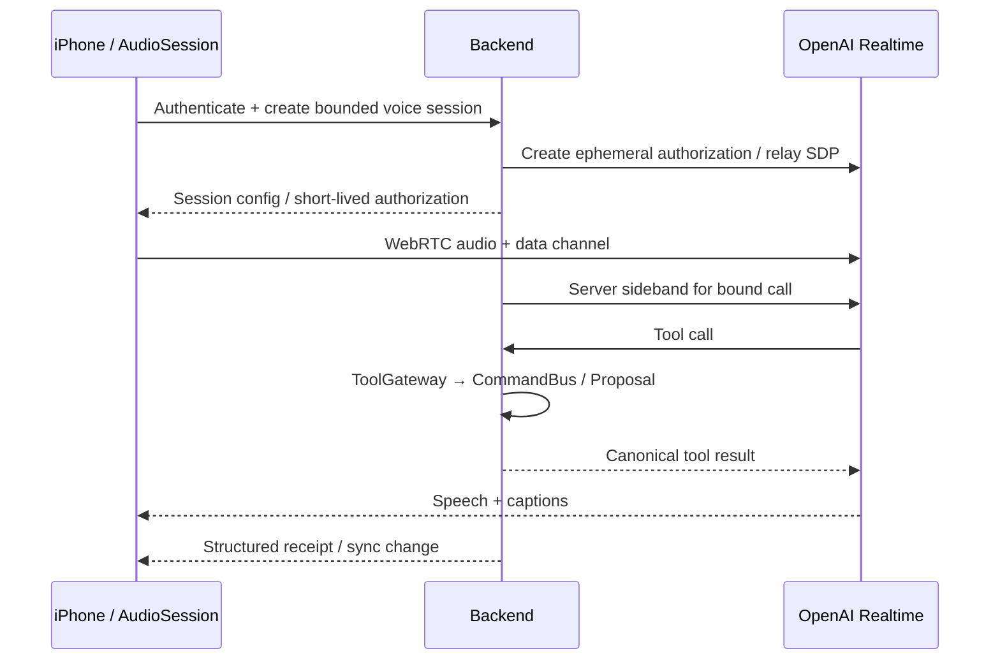

# 08. Голос и интеграции Apple

## 1. Общий принцип

Все интеграции используют те же domain commands, что и ручной интерфейс. Голос не отдельный чат с другой памятью; HealthKit не отдельный XP-калькулятор; Widget не пишет в ledger.

## 2. Voice MVP — Phase 4

Сначала вертикальный сценарий push-to-talk: нажать → произнести → увидеть распознанное намерение → выполнить или принять proposal → услышать результат. Постоянное фоновое прослушивание/собственное wake word не входит в план.

Realtime API поддерживает WebRTC, временные client secrets и серверное управление с sideband. Временную авторизацию выдаёт backend; обычный API key остаётся на сервере. [WebRTC](https://developers.openai.com/api/docs/guides/voice-webrtc), [Server-side controls](https://developers.openai.com/api/docs/guides/voice-server-controls)

Выбранный API в этой версии плана — **Realtime**, не смешивать его session/events с GPT-Live. Если provider/API меняется, adapter и fixtures пересматриваются явно.

### Привязка session к пользователю

Backend сохраняет app voice_session_id, user_id, device_id, provider call_id, authorization nonce, allowed scopes, expires_at, budget. Предпочтительный initial path: backend принимает SDP и сам создаёт provider call, чтобы получить call_id из доверенного ответа. Альтернативный ephemeral path допускается после проверки безопасной привязки call; не подключать privileged sideband к произвольному call_id, присланному клиентом.

Tool execution имеет **одного владельца — backend**. Если iOS тоже получает tool event по data channel, он отображает статус и не выполняет мутацию второй раз. Авторизованный user/session scope проверяется непосредственно при каждом tool call.

## 3. iOS voice implementation

Модули: `VoiceSessionCoordinator`, `RealtimeTransport`, `AudioSessionManager`, `TranscriptStore`, `VoiceToolStatusPresenter`. Native WebRTC library выбирается и проверяется в P0-02/P4-01: поддерживаемые iOS/архитектуры, лицензия, размер, обработка audio routing, актуальный release. SwiftUI сам по себе не предоставляет браузерный RTCPeerConnection; JS-пример из документации не считать native iOS SDK.

`AVAudioSession`/microphone permissions, Bluetooth/headphones/speaker, interruption телефоном, route changes, echo cancellation и VAD проверять на устройстве. Настройки audio категории/mode фиксировать после spike. Fallback: запись ограниченного аудио → backend transcription → обычный text turn → TTS; без сети обычный текстовый/manual UI.

Состояния: idle → requesting_permission → connecting → listening ↔ speaking → processing_tool/awaiting_confirmation → ended; interrupted/reconnecting/error доступны из активных состояний.

- Barge-in: остановить playback и согласовать provider conversation state, не только скрыть caption.
- Низкая уверенность в дате/имени: повторить короткое уточнение; command не коммитить.
- Повтор «я сделал тренировку» после reconnection не создаёт новую награду.
- Закрытие app/звонок: остановить/приостановить микрофон и обработать незавершённую команду; UI после возврата сверяет receipt.
- Session duration default 10 мин, idle timeout 60s, настраиваемый дневной бюджет; warning до остановки, graceful finish и учёт cost.
- Не хранить raw audio по умолчанию. Transcript — тот же retention/user controls, что и текст.
- «Готово» произносится после committed result. Sideband/stream interruption не является гарантированным отзывом уже прозвучавшей фразы; критическое подтверждение отображается канонической карточкой.

## 4. EventKit: Apple Calendar и Reminders — Phase 5

Внутренний календарь независим и работает без EventKit. Начать с импорта busy intervals из выбранных календарей и явного экспорта выбранных задач в выделенный System calendar. Двусторонняя синхронизация всех чужих событий не нужна для первой интеграции.

EventKit различает уровни доступа; для чтения существующих событий нужен соответствующий full access, а использование EventKitUI может позволить добавить событие без полного чтения календаря. Использовать актуальные usage descriptions и API target SDK. [Apple EventKit access](https://developer.apple.com/documentation/eventkit/accessing-the-event-store), [TN3152](https://developer.apple.com/documentation/technotes/tn3152-migrating-to-the-latest-calendar-access-levels)

Импорт по умолчанию: start/end/busy/calendar pseudonym; title/location/notes только если нужны и разрешены. Read-only календарь нельзя редактировать. Изменение события вне app инвалидирует proposals; EventKit notifications инициируют reconcile при следующей доступной возможности.

ExternalMapping: provider, device-scoped external ID, internal ID, original fingerprint, last sync revision, ownership. Event IDs могут требовать повторного поиска после изменений; не использовать их как вечную глобальную identity. Собственные exports имеют стабильную app linkage metadata/deep link. Предотвращать sync loops собственным revision/fingerprint.

Recurring events: this instance vs future series; исключения, отмены, all-day, DST. Удаление внешнего события не удаляет Goal/Activity/XP. Отказ/отзыв permission отключает интеграцию и помечает cached availability устаревшей.

Reminders: отдельное разрешение/adapter, сначала явный экспорт reminder и ручное сопоставление; completed reminder → обычный completion proposal, если данные не позволяют определить объём. Не дублировать одну задачу в Calendar/Reminders без выбора пользователя.

## 5. HealthKit — Phase 5, после core correctness

Initial scope: шаги и выбранные workouts. Данные сна/другие типы — позднее по конкретной функции. HealthKit используется для fitness-части продукта, с понятной целью и permissions.

Apple не раскрывает приложению, отказал ли пользователь именно в чтении: отсутствие samples не доказывает ни отказ, ни отсутствие активности. Запрашивать типы по потребности и использовать корректные usage descriptions. [HealthKit authorization](https://developer.apple.com/documentation/healthkit/authorizing-access-to-health-data), [Privacy](https://developer.apple.com/documentation/healthkit/protecting-user-privacy)

Pipeline: on-device query → unit/time normalization → deduplicate sample IDs/source → match occurrence → EvidenceRecord summary → server completion policy. На сервер по умолчанию только подтверждение/агрегат для задания, а не полный raw health history. Отправка даже aggregate в AI — отдельный consent; для XP AI не нужен.

Шаги: использовать корректную агрегирующую query и источники; не складывать произвольно overlapping phone/watch samples. Workouts: unique sample ID, start/end/type; при совпадении с timer/self-report attach evidence к root. Автоматическое выполнение разрешается отдельно для конкретного habit: «отмечать прогулку при достижении 8000 шагов». Нет HealthKit — self-report доступен.

Удаление/исправление sample не означает автоматически «пользователь соврал»: пересмотреть evidence, fallback self-report/уточнение, корректировать только небольшой evidence delta при необходимости. Защита от поддельного клиента не абсолютна; label Device Verified — подтверждение источником, не судебное доказательство.

## 6. Widgets, App Intents, Shortcuts, Action Button

Widget/Lock Screen: next quest, 3/6 completed, Current Level; читать minimal snapshot в App Group, без чата/секретов. После logout/delete очистить общую snapshot. Обновления opportunistic; не обещать посекундную актуальность.

App Intents: ShowToday, CaptureInbox, StartQuest, CompleteQuest, TalkToSystem. Для completion нужен определённый occurrence, объём/вариант; otherwise открыть confirmation UI. Widget intent пишет domain command в безопасную общую очередь с file/DB locking, основной sync reconciles. Siri/Shortcuts/Action Button используют intents на поддерживаемых устройствах; «Talk» открывает foreground voice session.

## 7. Live Activities

Показ active focus timer, remaining/elapsed, название при разрешённой lock-screen privacy. Timer вычисляется по timestamp, Live Activity — отображение, не источник времени/XP. Завершение/отмена отражается из canonical/local timer state. Push tokens для Activity не смешивать с APNs device tokens. После force quit/expiration состояние синхронизируется при возврате.

## 8. Уведомления

MVP: локальные scheduled notifications для ближайших reminders. Система iOS доставляет локальные уведомления по запланированному trigger; приложение может отменить pending request при completion/reschedule. [Apple local notifications](https://developer.apple.com/documentation/usernotifications/scheduling-a-notification-locally-from-your-app)

Реестр `notification_key = target_id + reminder_kind`, revision включает актуальное время. При переносе отменить старое и установить новое; completed/excused/cancelled отменяют reminder. Уведомления не считаются источником истины о статусе задачи.

Дедупликация local/remote: scheduled quest reminders принадлежат локальному scheduler. APNs в MVP служит для sync hints/редких server-origin событий другого типа; не посылать одновременно remote fallback для того же локального reminder без explicit ownership/ack protocol. Несколько устройств выбирают primary reminder device; это настройка.

Defaults: quiet hours по сну; максимум 4 proactive уведомления в день, кроме явно созданных time reminders; minimum suggestion ≤1/day, review ≤1/day. Отсутствие реакции снижает частоту предложения, не повышает её. Decay alerts — off по умолчанию, один при изменении статуса, отключены в Protection. Lock screen по умолчанию «Напоминание Системы», без чувствительного текста.

BackgroundTasks/APNs не гарантируют точный запуск кода в нужную минуту; day-close живёт на сервере, а app обновляет локальные данные при доступной возможности. [Apple background strategies](https://developer.apple.com/documentation/backgroundtasks/choosing-background-strategies-for-your-app)

## 9. Apple Watch — Phase 6

Companion после стабильного iPhone: next quest, timer, короткий capture, completion и selected workout evidence. Собственные pending commands с тем же idempotency; WatchConnectivity не гарантирует немедленную доставку. Standalone watch backend/auth отдельный scope; не добавлять в MVP.
