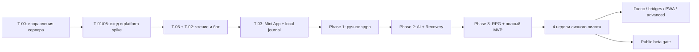

# 10. План разработки Telegram-системы

Актуально: 2026-09-16. Этот план заменяет прежнюю последовательность iOS. Исторические таблицы сохранены в [архиве](archive/pre-telegram-2026-09-16.txt); их незакрытые Mac-гейты не блокируют Telegram. Статус кода — [13](13-handoff.md), требования платформы — [14](14-telegram-platform.md), исправления — [15](15-backend-review.md).

## 1. Как исполнять

Каждая строка — самостоятельная задача, не объявление готовности. Сначала зависимость и meaningful regression test, затем реализация и проверка. Одна фаза готова только после её exit gate. API/worker сохраняются; не пересоздавать проект. Текущий запрос пользователя закрывается аудитом и документацией; следующие задачи реализации выполняются по поручению.

План различает: **технический demo**, **ручное ядро**, **полный продуктовый MVP**, **публичный релиз**. Наличие webhook и кнопки completion не доказывает полный цикл Системы.

T-04 hosting можно подготовить раньше для synthetic device-tests, но первый учёт реальных данных требует T-00, безопасного auth, Activity/ledger P3-02 и проверенного восстановления; до этого — synthetic data. Голос и Apple bridges не являются зависимостью advanced RPG.

## 2. Что уже есть и как перенесены прежние ID

| Прежний ID | Фактический результат | Что осталось |
|---|---|---|
| P0-00, P0-01a/b | Архитектура, окружение, backend pins, smoke | Native build снят для пилота; web toolchain ещё проверить |
| P0-04 | Threat model, RLS и sessions prototypes, secret scan | Telegram trust boundaries и фактический deploy |
| P1-01 | Миграции 001–008, схемы envelope, OpenAPI фактических routes | Закрытые payload schemas/DTO, новые domain tables по задачам |
| P1-02 | Synthetic dev login, access/refresh/revoke | Реальный Telegram login T-01; Apple proof больше не пилотный gate |
| P1-03 | CommandBus, receipts, batches, outbox/jobs/worker | T-00a/b; bootstrap/pull; handlers reminders/day-close |
| P1-06 | Template/occurrence команды, state transitions | ActivityRecord/объём/Undo, schemas, ручной UX; не весь P1-06 |
| P1-07 | CalendarMath/ensureUserDay | T-00c/d, Scheduler, reminders, закрытие дня; не весь P1-07 |
| P1-04 | Клиентская реализация отсутствует | Сохранён: IndexedDB journal вместо Swift SQLite, T-03 |
| P1-08 | Клиента нет | Перенесён в web UI, T-03 и последующие экраны |

## 3. Исправления до реальных данных

| ID | Scope / файлы | Проверки и готовность |
|---|---|---|
| T-00a ✔ | `shared/commands`, `modules/sync/routes`, quest parsers, contracts | Hash учитывает kind/семантику; top-level version/aggregate проверяются; closed payload schemas; неизвестные/prototype keys отвергаются; owner/device/dependencies не игнорируются. Все кейсы R1/R2/R6 из аудита |
| T-00b ✔ | `modules/sync/worker`, миграция 010 lease ownership, worker tests | Claim только свободной capacity; lease token CAS; late A не завершает B; expiry/max attempts/dead-letter/renewal; два workers |
| T-00c ✔ | `shared/time/user-day`, unit fixtures | Все минуты DST gap → первая допустимая граница по policy; fold; 30-minute change; non-hour zones; точность offset |
| T-00d ✔ | `modules/scheduling/user-days`, миграция 011 | Смена boundary/timezone применяется в определённый момент; существующий интервал не раздваивается; concurrent changes; один credited bucket |
| T-00e ✔ | `app.ts`, `worker.ts`, `shared/logging`, error translation, log tests | Raw PG/provider errors не раскрывают payload/credentials; инфраструктурная ошибка refresh не маскируется под неверный token |

**T-00a–e выполнены** (коммиты `453cf3f`, `a2b2345`, `25146a0`, `9b4c5d8`, `caa24d1`, `e15c349`, `a1e3903`; миграции 009–011). Подробности и отрицательные контроли — в [handoff](13-handoff.md), раздел 3. Это не значит, что сервер готов: остаётся Activity-часть R6 (P1-06), а Telegram-клиента, чтения и ledger нет вовсе. Старые миграции не переписывались; политика для прежних квитанций (`hash_version = 1`) — явный отказ, а не догадка.

> Следующая задача по порядку аудита — Telegram foundation (T-01, затем T-06), а Activity path закрывается до реального дневного учёта. T-01 требует токена тестового бота от владельца.

## 4. Telegram foundation и первая вертикаль

| ID | Scope / место | Зависимости | Проверки / готовый результат |
|---|---|---|---|
| T-01 ◑ | Identity mapping, `POST /auth/telegram` (**сделано**, миграция 013); installation binding — нет | T-00a/e | Forged/expired/future/duplicate initData, allowlist, replay, account isolation, secure storage fallback; реальный launch smoke отдельно |
| T-05 | Одноразовый platform spike и capability report | T-01; тестовый бот/HTTPS/телефон для device части | Fullscreen/safe areas/back, IndexedDB close/reopen/offline/kill, SecureStorage, home shortcut, mic. Указать observed failures, выбрать поддерживаемые clients |
| T-06 ◑ | `GET /bootstrap`, `GET /sync/pull` (**сделано**, миграция 014); bounded reads `/goals` `/quests` `/calendar` — нет | T-00a, P1-03 | Consistent snapshot+cursor, batches без дыр, paging upper bound, 410/rebootstrap, два tenants |
| T-02 | Webhook inbox, sender mapping, `/start`/`today`/`capture`, action tokens | T-01, T-06, T-00b/e | Duplicate/forged update, stale/foreign callback, response loss, blocked bot, 429; commands используют тот же bus. Completion подключать после P1-06 |
| T-03a | `apps/miniapp`: React/TS/Vite scaffold, adapters, design tokens, пять вкладок | T-01/05/06 | Login→Today→Goal/detail; real DTO, empty/error/auth states, accessibility, responsive safe areas; mocked demo отдельно от production |
| T-03b / P1-04 | IndexedDB repositories/outbox, SyncCoordinator, conflict inbox | T-03a, T-00a, T-06 | Commit-loss retry, close/reopen, pending preservation, account separation, denied/quota storage, dependent commands; offline scope честно отражён |
| T-04 | Hosting API/worker/PostgreSQL + static Mini App, TLS/webhook, secrets/backup/runbooks | T-01/02, T-00b/e | Production dev-login off, migration/runtime/worker roles, live readiness, restart, bot secret rotation, restore; synthetic smoke до реальных данных |

Railway указан как кандидат, а не уже выбранный оплаченный сервис. Сначала подготовить конкретную конфигурацию и ограничения (region, persistence, always-on worker, backups), затем выполнять фактическое подключение/публикацию в разрешённом scope. Dockerfile/compose до проверки не считать production-ready. Не включать secrets в Vite public env.

## 5. Phase 1 — ручное ядро

| ID | Что завершить | Зависимости | Критерий |
|---|---|---|---|
| P1-05 | Profile/onboarding/baseline, Goals/Milestones/Projects/Metrics/Inbox | T-01, T-03, contracts | Создать/изменить цель и реальные критерии, продолжить onboarding, baseline не даёт XP |
| P1-06 ◑ | ActivityRecord/root, actual duration/amount, variants, partial (**сделано**, миграция 012); timer, undo foundation — нет | T-00a, P1-03 | Выполнение хранит факты; minimum только при принятом spec; unknown duration не выдумывается; duplicates не создают второй root; UI и бот согласованы |
| P1-07 | Scheduler, availability/protected time, day/week/month, recurrence, day-close, reminders | T-00b/c/d, P1-05/06, T-02 | Дни не пересекаются, hard constraints, minimum/unscheduled, missed/excused, stale reminders отменены, no background JS dependency |
| P1-08 | Закончить Today/Goals/Calendar/Character shell, Settings/Privacy и motion | T-03, P1-05…07 | Все manual действия, sync state, large RU text, screen readers; Character пока честно 0/недоступно без fake reward |
| P1-09 | Export/delete, web/backend CI, deployment rehearsal | P1-02…08, T-04 | Export читается, delete/revoke не возрождаются replay, restore применяет deletion registry; ручной цикл 7 дней на устройстве с synthetic data |

Exit: Goal → scheduled quest → сохранённая Activity; ручной перенос/minimum/partial/excuse, delayed sync и восстановление без двойного эффекта. Пока отсутствует production XP/AI, этап называется ручным ядром. До первого тестирования реальными данными выполнить P3-02 (ledger) и privacy/restore gate, как требует AGENTS.md. Phase 1 проверяется на synthetic fixtures.

## 6. Phase 2 — текстовая Система

| ID | Scope | Зависимости | Критерий |
|---|---|---|---|
| P0-03 | Bounded real provider spike, model IDs/budget/cost report | Рабочий backend; настроенный ключ | Русский ввод, strict tools, refusal/429/timeout/usage; версия SDK проверена |
| P2-01 | AIProvider/OpenAI adapter, turn lifecycle/SSE для Mini App | P0-03, Phase 1 | Streaming/reconnect/cancel; бот получает bounded result, не поток каждого token |
| P2-02 | ContextBuilder, read tools, factual cards, единая дата/зона | P2-01 | Relevant-only, two tenants, timestamps и цифры grounded |
| P2-03 | ToolGateway/policy/proposals/PlanDiff, Telegram adapter | P2-02, T-00a | Все writes через CommandBus; prompt injection/XP bypass/stale proposal/duplicate tool заблокированы |
| P2-04 | Goal interview/GoalPlanDraft, classifier/dynamic skills/rubrics | P2-03, P1-07 | Из понятной цели принят посильный roadmap, duplicate skill не создаётся |
| P2-05 | Visible memory, DailyReview, Motivation policy | P2-02…04 | Forget/delete распространяется, цифры из backend, нет давления/унижения |
| P2-06 | Recovery case/reason/capacity и изменение плана | P1-07, P2-03…05 | Болезнь/сон без долга; неизвестная причина не лень; нет recursive debt |

Exit: «Хочу английский» → принятый план → Today; «перенеси» меняет ровно один target; «не успеваю» предлагает выполнимый diff. Отключённый ИИ сохраняет manual core.

## 7. Phase 3 — детерминированная RPG и продуктовый MVP

| ID | Scope | Зависимости | Критерий |
|---|---|---|---|
| P3-01 | Pure Progression Engine, integer milli-XP, rule versions | P1-06, принятые rubrics P2-04 | Golden/property: zero, split invariance, caps, no AI/IO |
| P3-02 | Ledger migrations/service, reversals, replay/backfill | P3-01, T-00a…d | Retry/undo/evidence upgrade/concurrent caps/replay; один reward root |
| P3-03 | Skill/stat mastery, allocations, levels/gates, hierarchy/merge | P3-02 | Conservation, parent не даёт второй reward, new skill = 0 |
| P3-04 | Form/CurrentLevel/Rank/Streak/Protection/RecoveryDebt | P3-03, P2-06 | 365-day fixtures, rank hysteresis, sickness no penalty, Mastery no decay |
| P3-05 | Web Character/Skill/history/reward receipts/celebrations | P3-01…04 | Confirmed/pending разделены, animation once, fallback motion; preview только при parity |
| P3-06 | MVP audit и 4 недели личного пилота, balance/utility report | Phase 1–3, T-04 | Полный цикл, все 20 пунктов §71 в адаптации Telegram, costs/backups/нагрузка, закрытые критические дефекты |

Exit: Goal → AI Plan → Daily Quest → Completion → XP → Review → Adaptation. Локальные уведомления заменены ботом; SQLite — web journal; offline cold start не заявляется без device proof. Эти platform differences явно принимаются как ADR-014, а не скрываются под фразой «всё реализовано».

## 8. Phase 4 — голос

| ID | Scope | Проверки / готовность |
|---|---|---|
| P4-01 | Telegram voice download/ASR job/retention | Size/time/type limits, retries, duplicate update, audio cleanup, RU/noisy fixtures |
| P4-02 | Transcript→intent→общий ToolGateway, quota/cost | Unknown amount/target, 429, command after cancel, injection, один effect |
| P4-03 | Canonical text receipt + optional TTS | Озвученные факты совпадают с сервером; no raw audio retention by default |
| P4-04 | Mini App foreground recording + fallback к voice бота | Реальные mic denial/background/call/network; manual text работает |
| P4-05 | Необязательный browser realtime spike→ADR→реализация | Barge-in, session binding, one tool executor, reconnect/cost; отдельный release gate |

Зависимость P4-01…03: работающий T-02 и P2-03; широкое включение после основного пилота. Realtime не обязателен для voice notes.

## 9. Phase 5 — сохранение интеграций и offline

| ID | Scope | Зависимости | Проверки / граница |
|---|---|---|---|
| P5-01 | ICS export/subscription | P1-07/09 | UID/revision/DST/cancellation, token revoke, реальный Calendar; one-way |
| P5-02 | Busy-only Shortcuts/provider import, optional reminders mapping | P5-01, P2-03 | Partial snapshot, stale, permission/revoke, export-import loop; без Apple ID password |
| P5-03 | Health Shortcuts spike + normalized evidence adapter | P3-02, explicit consent | Phone/watch duplication, source quality, sample corrections, no double XP; no automatic release при неверных шагах |
| P5-04 | Home shortcut, Action Button/Shortcuts/widget quick actions | T-03, routing/auth | Supported/unsupported clients, locked phone, stale target, scoped credentials |
| P5-05 | Решение о native companion для HealthKit/widgets/Live Activity | Реальная потребность, Mac отдельно | Не требуется Telegram MVP; native tests/provisioning при выбранном scope |
| P5-06 | Тот же клиент как PWA, standalone auth, service worker | T-03b, P1-09, device spike | Offline cold start, update preserving journal, pairing replay/session swapping, eviction, optional push |

Каждая integration включается независимо; отказ не блокирует ядро. P5-04 можно начать раньше остальных. Details: [08](08-voice-and-apple.md).

## 10. Phase 6 — развитие и публичный продукт

| ID | Scope | Готовность |
|---|---|---|
| P6-01 | Weekly/Monthly Review, pattern aggregates | 4+ недели фактов; small-sample uncertainty, актуальный denominator |
| P6-02 | Deep memory/search, provenance/correction | Tenant фильтр до retrieval, consent/deletion, stale hypotheses |
| P6-03 | Advanced Scheduler/automation/DifficultyScaling | Opt-in boundaries, hard constraints, rollback, manual overrides; внешние calendars необязательны |
| P6-04 | Forecast/experiments | Comparable metrics, assumptions/ranges, insufficient-data state |
| P6-05 | Skill Trees/Boss/avatar evolution | Реальные checkpoints, собственные assets, нет reward loopholes |
| P6-06 | Public beta readiness | Pilot fixes, signup/rate limits, нагрузка, restore/deletion/support, регионы/возраст/условия, platform review |
| P6-07 | Optional Watch/native extensions | Отдельное поручение, hardware/toolchain, общий command API |

Публичная beta может предшествовать необязательным Phase 4–6 функциям, если gate P6-06 выполнен и scope явно указан. Монетизация и платежи — отдельное решение с проверкой актуальных правил, не скрытая задача текущего плана.

## 11. Definition of Done и работа с лимитом

- Контракты/migrations/fixtures/consumers согласованы; нет production fake success.
- Запущены meaningful проверки изменённого пути; device/API тесты с mocks не названы реальными.
- Нет утечки user data/keys, bypass RLS/XP, потери pending из-за logout/rebootstrap.
- Handoff: task ID, actual files, проверки, ограничения, следующий шаг. Чужой завершённый scope не переписывать исторически как отсутствующий.
- Выбирать небольшой завершённый срез; до начала и конца читать usage при наличии инструмента, оставлять ~10 процентных пунктов резерва. Не начинать новый этап ради расходования остатка.

Fixtures: два tenants, два клиента одного пользователя (бот/Mini App), 14 дней расписания, 30 дней reviews, 365+ дней прогрессии, DST/travel, interrupted network, stale messages, duplicated evidence. Реальные данные нужны после correctness/privacy gate.

## 12. Первый запрос следующей модели

> Прочитай AGENTS.md, docs/13-handoff.md, docs/15-backend-review.md и спецификации 02/06. Выполни T-00a: исправь нормализацию и валидацию команд, hash семантики и проверку top-level expected_version/aggregate_id. Сначала добавь regression tests R1/R2/R6, затем исправь код и контракты без переписывания старых миграций. Учти уже выданные receipts и отсутствующую регистрацию devices; не заявляй, что T-01 уже реализован. Проверь typecheck/unit/contracts и affected DB integration на отдельной synthetic DB. Обнови handoff; остальные T-00 не отмечай готовыми.

Сроки не обещаются по количеству таблиц: полезную первую вертикаль выпускаем отдельно от полного MVP, затем измеряем фактическую скорость. Mac больше не входит в критический путь Telegram.
